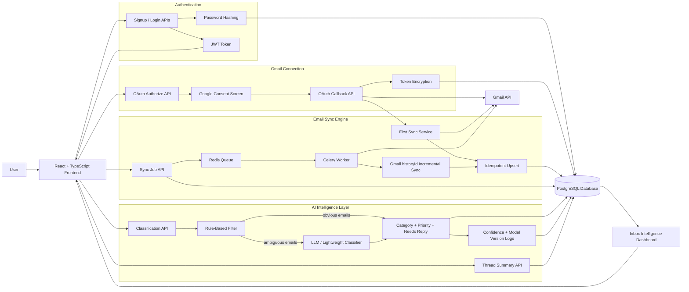

# MailMind

MailMind is a production-style AI email cleaner and inbox intelligence app. The first milestone is a deployable SaaS skeleton with FastAPI, PostgreSQL, JWT authentication, React, Docker Compose, tests, and a clear path toward Gmail sync and AI features.

## Current Milestone

Week 5 hybrid search is in progress:

- FastAPI backend with health, signup, login, and `/me`
- SQLAlchemy models and Alembic setup
- JWT auth with password hashing
- React frontend with auth, dashboard, and inbox intelligence screens
- Docker Compose for backend, frontend, worker, PostgreSQL, and Redis
- Backend tests for auth, Gmail sync, and AI classification
- CI workflow for backend tests and frontend build
- Google OAuth URL and callback endpoints
- Encrypted Gmail refresh-token storage
- Gmail accounts, threads, and emails persisted in PostgreSQL
- Idempotent first sync with no duplicate email rows on re-run
- Redis/Celery background worker service for Gmail re-sync jobs
- Sync job tracking with queued, running, retrying, succeeded, and failed states
- Incremental re-sync path using Gmail history IDs
- Retry classification for temporary Google API failures
- Two-stage AI classification: rule-based pre-filter, then LLM (if configured) or a lightweight local fallback
- Classification metadata (category, priority, needs_reply, confidence, model_version) stored per email plus an append-only audit log
- Thread summarization with the same LLM/fallback split
- Evaluation harness (`scripts/evaluate_classifier.py`) reporting precision/recall/F1 against a labeled dataset, plus `scripts/export_emails_for_labeling.py` to build one from your real inbox
- Hybrid email search API (`GET /api/v1/gmail/search`) combining PostgreSQL full-text search, pgvector cosine distance, deterministic local embeddings, and Reciprocal Rank Fusion
- Dashboard search panel showing RRF score, keyword rank, semantic rank, and match reason

## Tech Stack

- Backend: FastAPI, SQLAlchemy, Alembic, PostgreSQL, Pydantic, JWT, Gmail API, Celery
- Frontend: React, TypeScript, Tailwind CSS, React Query, React Router
- Infrastructure: Docker Compose, Redis, Celery workers, GitHub Actions, encrypted token storage
- AI/Search: OpenAI-compatible GPT classification, deterministic local embeddings for offline search, PostgreSQL full-text search, pgvector indexing, and hybrid RRF ranking

## Quick Start

Copy the environment file:

```bash
cp .env.example .env
```

Run the stack:

```bash
docker compose up --build
```

Open:

- Frontend: `http://localhost:5173`
- Backend API: `http://localhost:8000`
- API docs: `http://localhost:8000/docs`

Run backend tests locally:

```bash
cd backend
pip install -r requirements.txt
pytest
```

Run frontend checks locally:

```bash
cd frontend
npm install
npm run build
```

## Roadmap

| Week | Milestone | Shippable Outcome |
| --- | --- | --- |
| 1 | Foundation | Signup, login, database, Dockerized app |
| 2 | Gmail integration | Google OAuth, refresh token storage, first email sync |
| 3 | Sync engine | Incremental sync, idempotent re-sync, Redis/Celery workers, retries, logging |
| 4 | AI layer | Labeled eval set, two-stage classification, confidence/model logging, precision/recall/F1 |
| 5 | Semantic search | Hybrid Postgres full-text + pgvector search with RRF; benchmark vs vector-only and keyword-only |
| 6 | Inbox intelligence | Health score formula: unread ratio + avg response time + still-mailing-after-unsubscribe count |
| 7 | Production engineering | Tests, rate limiting, pagination, filtering, monitoring, deployment, cost/token tracking per user |
| 8 | Polish | Dashboard, charts, README diagrams, eval numbers, benchmark table, screenshots, demo video |

## Architecture


## Repository Layout

```text
MailMind/
  backend/
    app/
    alembic/
    tests/
  frontend/
    src/
  docs/
    architecture.md
    roadmap.md
  .github/
    workflows/
  docker-compose.yml
```


