# MailMind

MailMind is a production-style AI email cleaner and inbox intelligence app. The first milestone is a deployable SaaS skeleton with FastAPI, PostgreSQL, JWT authentication, React, Docker Compose, tests, and a clear path toward Gmail sync and AI features.

## Current Milestone

Week 8 polish and production packaging is in progress:

- FastAPI backend with health, signup, login, and `/me`
- SQLAlchemy models and Alembic setup
- JWT auth with password hashing
- React frontend with auth, dashboard, and inbox intelligence screens
- Docker Compose for backend, frontend, worker, PostgreSQL, and Redis
- Backend tests for auth, Gmail sync, and AI classification
- CI workflow for backend tests and frontend build
- Google OAuth URL and callback endpoints
- Encrypted Gmail refresh-token storage
- Gmail accounts, threads, and emails persisted in PostgreSQL
- Idempotent first sync with no duplicate email rows on re-run
- Redis/Celery background worker service for Gmail re-sync jobs
- Sync job tracking with queued, running, retrying, succeeded, and failed states
- Incremental re-sync path using Gmail history IDs
- Retry classification for temporary Google API failures
- Two-stage AI classification: rule-based pre-filter, then LLM (if configured) or a lightweight local fallback
- Classification metadata (category, priority, needs_reply, confidence, model_version) stored per email plus an append-only audit log
- Thread summarization with the same LLM/fallback split
- Evaluation harness (`scripts/evaluate_classifier.py`) reporting precision/recall/F1 against a labeled dataset, plus `scripts/export_emails_for_labeling.py` to build one from your real inbox
- Hybrid email search API (`GET /api/v1/gmail/search`) combining PostgreSQL full-text search, pgvector cosine distance, deterministic local embeddings, and Reciprocal Rank Fusion
- Dashboard search panel showing RRF score, keyword rank, semantic rank, and match reason
- Inbox health API (`GET /api/v1/gmail/insights`) with an explicit formula using unread ratio, high-priority unread emails, pending replies, and cleanup candidates
- Cleanup suggestions for low-value newsletters/promotions, aged follow-ups, pending replies, and high-priority unread emails, including top candidate emails and sender breakdowns
- Safe cleanup preview API (`GET /api/v1/gmail/cleanup/preview`) showing archive candidates, reasons, confidence, and estimated time saved
- Sender intelligence API (`GET /api/v1/gmail/senders`) grouping inbox noise by sender with suggested review actions
- Filtered/paginated email API (`GET /api/v1/gmail/emails`) with category, priority, read-state, reply-state, sender, limit, and offset filters
- Sync health API (`GET /api/v1/gmail/sync/health`) summarizing queued/running/retrying/succeeded/failed jobs and Gmail error counts
- Staged real-inbox sync limits (`POST /api/v1/gmail/sync?max_results=100`) for safe 25 -> 100 -> 500+ Gmail benchmarking
- Product mode banner and sync progress display for demo vs real Gmail workspaces
- Reversible cleanup undo for archive/mark-read actions using an audit log of prior Gmail labels and read state
- Dedicated cleanup review page (`/cleanup`) with filters, search, visible selection, bulk archive/mark-read, undo, and not-cleanup feedback
- Spam-risk scoring with optional pretrained local model support, deterministic fallback, persisted spam metadata, and cleanup ranking boosts
- Large synthetic inbox benchmark for 10k+ Gmail-like records, measuring classification coverage, spam-risk volume, cleanup candidates, and search latency without exposing private email data

## Validation Snapshot

Current AI classification smoke-eval uses the bundled 40-row synthetic seed set in `backend/eval/labeled_emails.csv`:

| Task | Accuracy | Macro F1 |
| --- | ---: | ---: |
| Category classification | 0.975 | 0.964 |
| Priority classification | 0.850 | 0.811 |
| Needs-reply detection | 0.900 | 0.875 |

Search benchmarking now compares `keyword`, `vector`, and `hybrid` retrieval modes with Hit@1, Hit@3, and MRR. Real search benchmark numbers require a synced inbox plus `backend/eval/search_queries.example.csv` expanded with actual `expected_email_id` labels.

Large-inbox benchmarking can be run with `python -m scripts.benchmark_large_inbox --seed-count 10000 --reset`, producing `backend/eval/large_inbox_benchmark.md` for recruiter-safe aggregate metrics.
## Tech Stack

- Backend: FastAPI, SQLAlchemy, Alembic, PostgreSQL, Pydantic, JWT, Gmail API, Celery, rate-limit guards, AI usage ledger
- Frontend: React, TypeScript, Tailwind CSS, React Query, React Router
- Infrastructure: Docker Compose, Redis, Celery workers, GitHub Actions, encrypted token storage, Gmail modify scope
- AI/Search: OpenAI-compatible GPT classification, deterministic local embeddings for offline search, PostgreSQL full-text search, pgvector indexing, hybrid RRF ranking, and formula-based inbox health scoring

## Quick Start

Copy the environment file:

```bash
cp .env.example .env
```

Run the stack:

```bash
docker compose up --build
```

Open:

- Frontend: `http://localhost:5173`
- Backend API: `http://localhost:8000`
- API docs: `http://localhost:8000/docs`

Run backend tests locally:

```bash
cd backend
pip install -r requirements.txt
pytest
```

Run frontend checks locally:

```bash
cd frontend
npm install
npm run build
```


## Production Deployment

Use [Deployment guide](docs/deployment.md) for env vars, service commands, health checks, demo seeding, and the final smoke checklist. After deployment, run `python -m scripts.smoke_deployment --base-url <api>/api/v1` from `backend/`.

## Demo Inbox Mode

You can run MailMind end-to-end without Google OAuth or real Gmail data:

```bash
docker compose exec backend python -m scripts.seed_demo_inbox --count 150 --reset
```

Then login at `http://localhost:5173` with `demo@mailmind.dev` / `DemoPass123!`. Demo login is available from the auth page for deployed recruiter walkthroughs.
## Roadmap

| Week | Milestone | Shippable Outcome |
| --- | --- | --- |
| 1 | Foundation | Signup, login, database, Dockerized app |
| 2 | Gmail integration | Google OAuth, refresh token storage, first email sync |
| 3 | Sync engine | Incremental sync, idempotent re-sync, Redis/Celery workers, retries, logging |
| 4 | AI layer | Labeled eval set, two-stage classification, confidence/model logging, precision/recall/F1 |
| 5 | Semantic search | Hybrid Postgres full-text + pgvector search with RRF; benchmark vs vector-only and keyword-only |
| 6 | Inbox intelligence | Health score, cleanup preview, safe Gmail actions, sender insights, and user feedback loop |
| 7 | Production engineering | Tests, rate limiting, AI cost/token tracking per user, pagination/filtering, monitoring, deployment |
| 8 | Polish | Dashboard, charts, README diagrams, eval numbers, benchmark table, screenshots, demo video |

## Architecture

```mermaid
flowchart TD
    U[User] --> FE[React + TypeScript Frontend]
    FE --> DASH[Inbox Intelligence Dashboard]

    subgraph API[FastAPI Backend]
        AUTH[Auth APIs]
        GMAIL[Gmail OAuth APIs]
        SYNC[Sync Job APIs]
        MONITOR[Sync Health API]
        AI[AI Classification APIs]
        SEARCH[Hybrid Search API]
        CLEANUP[Cleanup Action APIs]
        FEEDBACK[Feedback API]
        EVAL[Evaluation Report API]
        USAGE[AI Usage API]
    end

    subgraph AUTH_FLOW[Authentication]
        AUTH --> HASH[Password Hashing]
        AUTH --> JWT[JWT Access Token]
        HASH --> DB[(PostgreSQL)]
        JWT --> FE
    end

    subgraph GMAIL_FLOW[Gmail Connection + Sync]
        GMAIL --> CONSENT[Google Consent Screen]
        CONSENT --> CALLBACK[OAuth Callback]
        CALLBACK --> ENC[Encrypt Refresh Token]
        CALLBACK --> FIRST[First Email Sync]
        SYNC --> REDIS[Redis Queue]
        REDIS --> WORKER[Celery Worker]
        WORKER --> HIST[Gmail historyId Incremental Sync]
        FIRST --> UPSERT[Idempotent Email Upsert]
        HIST --> UPSERT
        MONITOR --> HEALTH[Job Status + Error Counts]
    end

    subgraph AI_FLOW[AI Layer]
        AI --> RULES[Rule-Based Pre-Filter]
        RULES -->|obvious emails| LABELS[Category + Priority + Needs Reply]
        RULES -->|ambiguous emails| LLM[LLM / Lightweight Classifier]
        LLM --> LABELS
        LABELS --> LOGS[Confidence + Model Version Logs]
        AI --> SUMMARY[Thread Summary]
        EVAL --> REPORT[Precision / Recall / F1 Report]
        USAGE --> COSTS[Token + Cost Summary]
    end

    subgraph SEARCH_FLOW[Week 5 Hybrid Search]
        SEARCH --> QEMB[Query Embedding]
        SEARCH --> FTS[Postgres Full-Text Search]
        QEMB --> VEC[pgvector Cosine Search]
        FTS --> RRF[Reciprocal Rank Fusion]
        VEC --> RRF
        RRF --> RESULTS[Ranked Email Results]
    end

    subgraph CLEANUP_FLOW[Week 6 Cleanup Intelligence]
        DASH --> PREVIEW[Review Cleanup Candidates]
        PREVIEW --> CLEANUP
        CLEANUP --> MODIFY[Gmail Modify: remove INBOX / UNREAD]
        MODIFY --> MIRROR[Mirror Labels + Read State Locally]
        DASH --> FEEDBACK
        FEEDBACK --> HUMAN[Human Correction Log]
    end

    GM[Gmail API]

    GMAIL --> GM
    FIRST --> GM
    WORKER --> GM
    MODIFY --> GM
    ENC --> DB
    UPSERT --> DB
    LABELS --> DB
    LOGS --> DB
    SUMMARY --> DB
    FTS --> DB
    VEC --> DB
    MIRROR --> DB
    HUMAN --> DB
    REPORT --> DASH
    COSTS --> DASH
    RESULTS --> DASH
    HEALTH --> DASH
    DB --> DASH
```


## Supporting Docs

- [API reference](docs/api.md)
- [System design guide](docs/system-design.md)
- [Real Gmail evaluation workflow](docs/real-inbox-evaluation.md)
- [Demo inbox mode](docs/demo-mode.md)
- [Deployment guide](docs/deployment.md)
- [Pre-deployment feature checklist](docs/pre-deployment-checklist.md)
- [Search benchmark notes](docs/search-benchmark.md)
- [Spam detection and public dataset evaluation](docs/spam-detection.md)
- [Large inbox benchmark](docs/large-inbox-benchmark.md)

## Repository Layout

```text
MailMind/
  backend/
    app/
    alembic/
    tests/
  frontend/
    src/
  docs/
    api.md
    architecture.md
    system-design.md
    real-inbox-evaluation.md
    demo-mode.md
    roadmap.md
    deployment.md
    search-benchmark.md
  .github/
    workflows/
  docker-compose.yml
```
