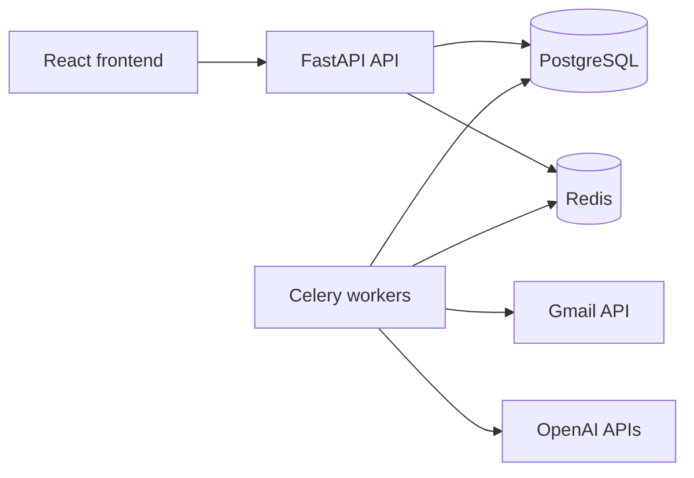

# MailMind

MailMind is a production-style AI email cleaner and inbox intelligence app. The first milestone is a deployable SaaS skeleton with FastAPI, PostgreSQL, JWT authentication, React, Docker Compose, tests, and a clear path toward Gmail sync and AI features.

## Current Milestone

Week 1 foundation is scaffolded:

- FastAPI backend with health, signup, login, and `/me`
- SQLAlchemy models and Alembic setup
- JWT auth with password hashing
- React frontend with auth and dashboard screens
- Docker Compose for backend, frontend, PostgreSQL, and Redis
- Backend tests for signup, login, and authenticated user lookup
- CI workflow for backend tests and frontend build

## Tech Stack

- Backend: FastAPI, SQLAlchemy, Alembic, PostgreSQL, Pydantic, JWT
- Frontend: React, TypeScript, Tailwind CSS, React Query, React Router
- Infrastructure: Docker Compose, Redis, GitHub Actions
- Planned AI: OpenAI GPT, embeddings, pgvector, RAG-style semantic search

## Quick Start

Copy the environment file:

```bash
cp .env.example .env
```

Run the stack:

```bash
docker compose up --build
```

Open:

- Frontend: `http://localhost:5173`
- Backend API: `http://localhost:8000`
- API docs: `http://localhost:8000/docs`

Run backend tests locally:

```bash
cd backend
pip install -r requirements.txt
pytest
```

Run frontend checks locally:

```bash
cd frontend
npm install
npm run build
```

## Roadmap

| Week | Milestone | Shippable Outcome |
| --- | --- | --- |
| 1 | Foundation | Signup, login, database, Dockerized app |
| 2 | Gmail integration | Google OAuth, refresh token storage, first email sync |
| 3 | Sync engine | Incremental sync, Redis/Celery workers, retries, logging |
| 4 | AI layer | Classification, priority, reply detection, thread summaries |
| 5 | Semantic search | pgvector embeddings and natural-language email search |
| 6 | Inbox intelligence | Health score, follow-up detection, newsletter cleanup, weekly reports |
| 7 | Production engineering | Tests, rate limiting, pagination, filtering, monitoring, deployment |
| 8 | Polish | Dashboard, charts, README diagrams, screenshots, demo video |

## Architecture



## Repository Layout

```text
MailMind/
  backend/
    app/
    alembic/
    tests/
  frontend/
    src/
  docs/
    architecture.md
    roadmap.md
  .github/
    workflows/
  docker-compose.yml
```
