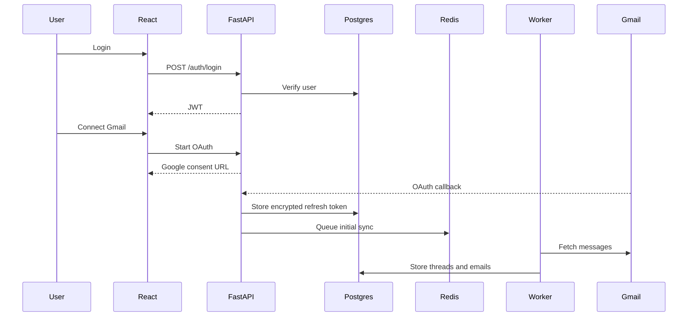
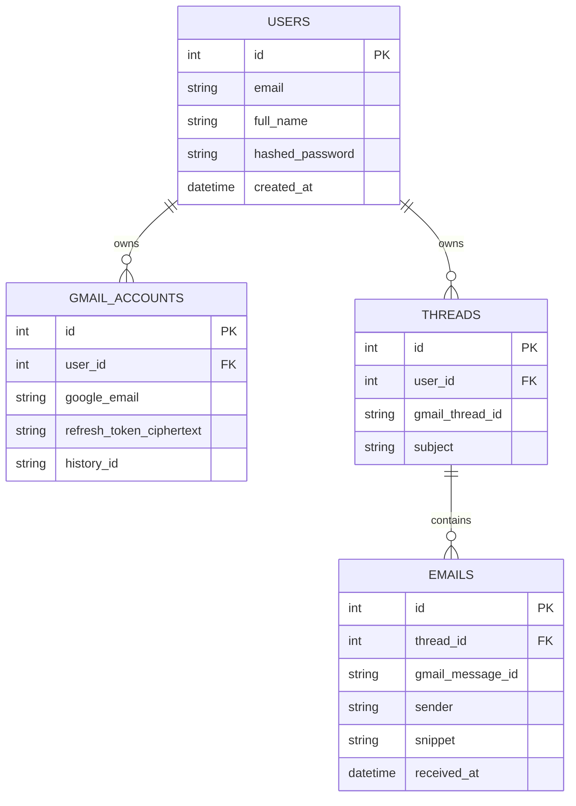

# Architecture

## System Context

MailMind is split into a React client, FastAPI backend, PostgreSQL database, Redis broker, and background workers. The backend owns authentication, API contracts, Gmail OAuth, and user-facing queries. Workers own long-running sync and AI jobs.

## Initial Data Model

## Production Notes

- Encrypt OAuth refresh tokens before writing them to PostgreSQL.
- Use Gmail `historyId` for incremental sync after the initial import.
- Move sync, embeddings, summaries, and classification into workers.
- Add idempotency keys around Gmail message imports.
- Add pagination and filtering before syncing large accounts.
