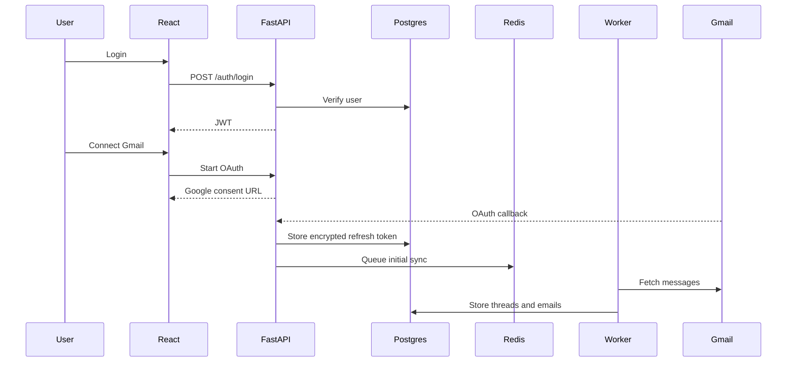
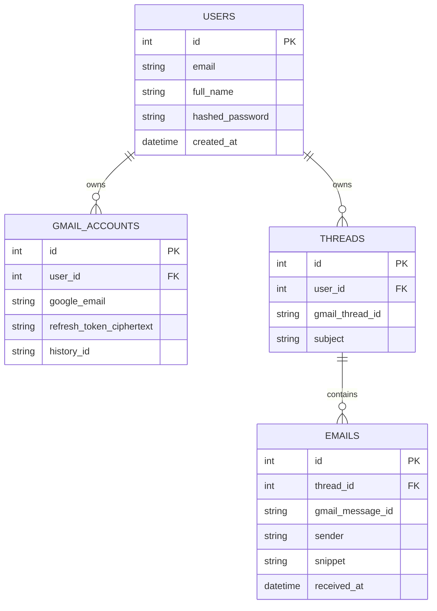

# Architecture

## System Context

MailMind is split into a React client, FastAPI backend, PostgreSQL database, Redis broker, and background workers. The backend owns authentication, API contracts, Gmail OAuth, and user-facing queries. Workers own long-running sync and AI jobs.

## Initial Data Model

## Production Notes

- Encrypt OAuth refresh tokens before writing them to PostgreSQL.
- Use Gmail `historyId` for incremental sync after the initial import.
- Move sync, embeddings, summaries, and classification into workers.
- Add idempotency keys around Gmail message imports.
- Add pagination and filtering before syncing large accounts.

## Week 2 Gmail Surface

- `GET /api/v1/gmail/oauth/authorize`: returns a Google consent URL for the signed-in user.
- `GET|POST /api/v1/gmail/oauth/callback`: exchanges the OAuth code, stores the encrypted refresh token, and runs the first sync.
- `POST /api/v1/gmail/sync`: queues a background re-sync job for the connected Gmail account.
- `GET /api/v1/gmail/accounts`: lists connected Gmail accounts for the current user.
- `GET /api/v1/gmail/emails`: returns latest persisted emails for dashboard display.

The first-sync path upserts by Gmail account/message IDs so repeated sync runs update existing rows instead of creating duplicates.

## Week 3 Sync Engine

- `POST /api/v1/gmail/sync`: creates a `sync_jobs` row and queues a Celery task through Redis.
- `GET /api/v1/gmail/sync/jobs`: lists sync jobs for the signed-in user.
- `GET /api/v1/gmail/sync/jobs/{job_id}`: returns sync status, attempts, counts, errors, and task ID.
- Worker task: refreshes the Gmail access token, runs initial sync or Gmail `historyId` incremental sync, then updates job status.
- Job states: `queued`, `running`, `retrying`, `succeeded`, `failed`.
- Retry policy: transient Google API failures such as timeout, 429, 500, 502, 503, and 504 are retryable; OAuth/auth and bad-request failures are terminal.
- Idempotency: Gmail account/message unique constraints keep re-sync from inserting duplicate rows.
- Structured log events include `sync.started`, `sync.gmail_history_fetch.started`, `sync.message_created`, `sync.message_updated`, `sync.completed`, `sync.retry_scheduled`, and `sync.failed`.

