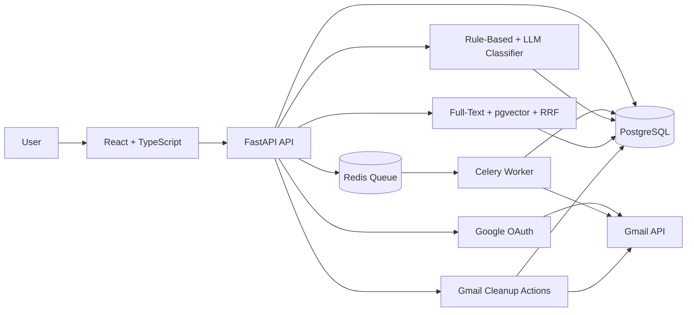
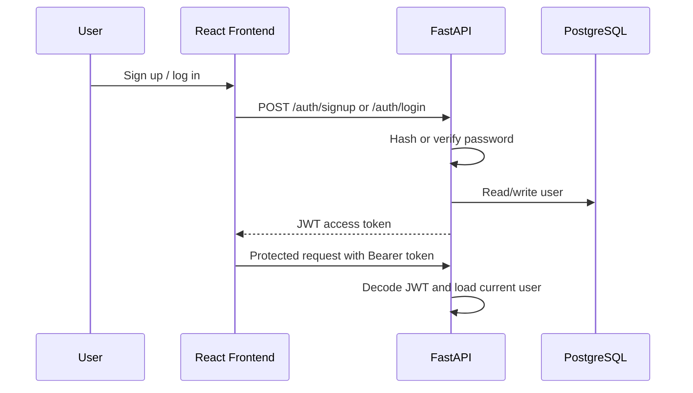
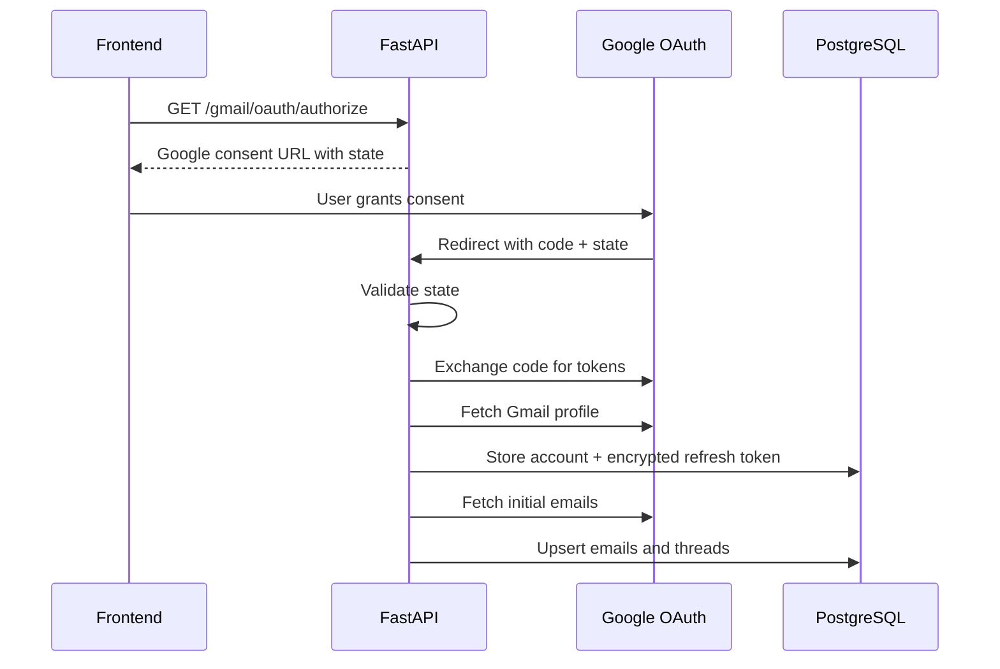
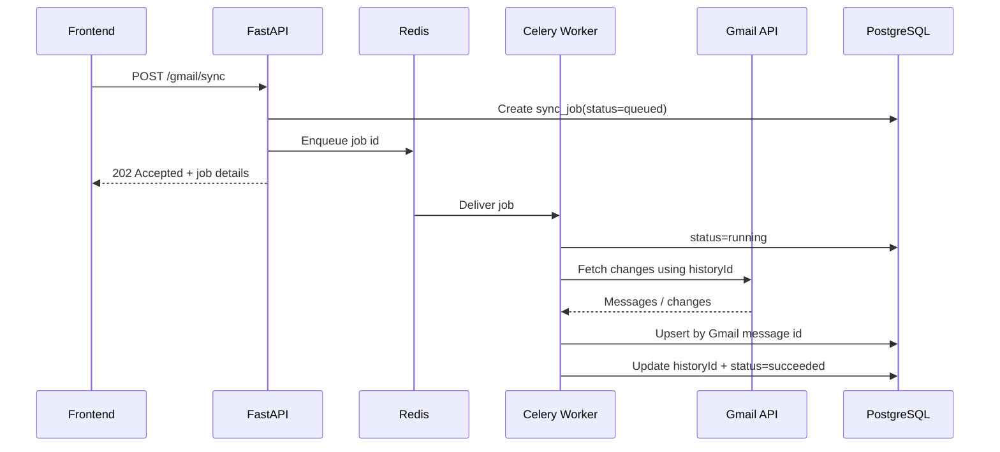
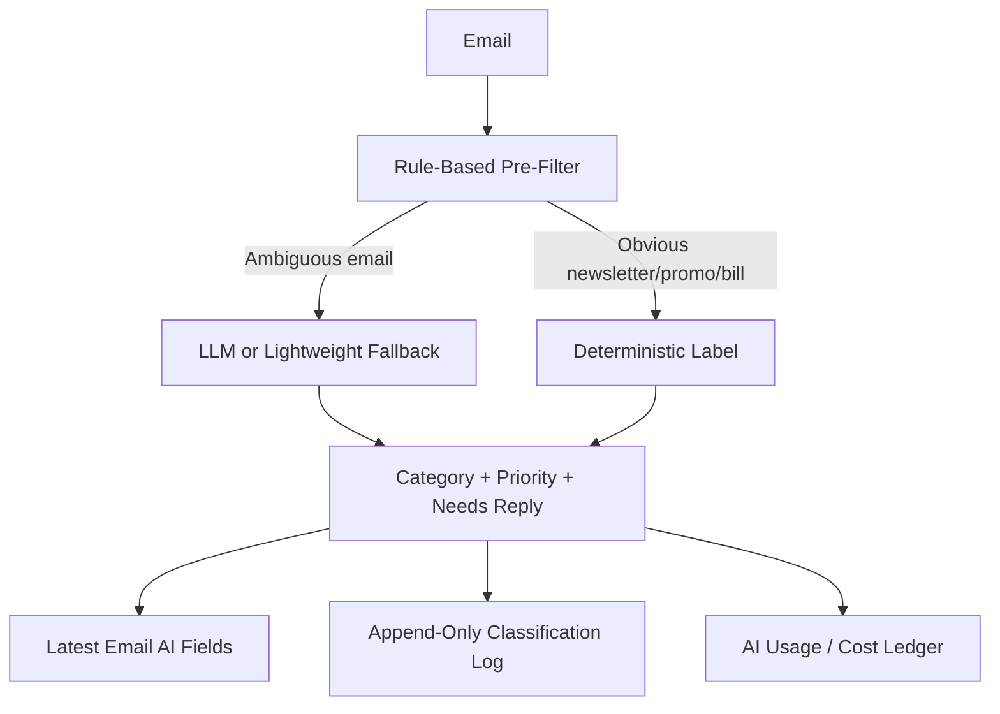
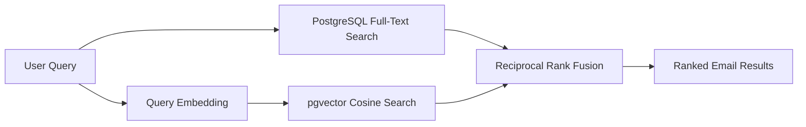
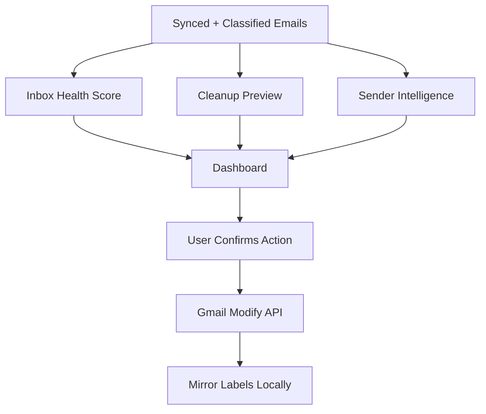

# MailMind System Design

MailMind is an AI-powered Gmail cleaner and inbox intelligence SaaS. It connects a user's Gmail account, syncs emails in the background, classifies messages, ranks search results with hybrid retrieval, and suggests safe cleanup actions.

## 1. Problem Statement

Normal inboxes become noisy because newsletters, promotions, alerts, bills, recruiter emails, and pending replies all sit in the same place. MailMind solves this by adding reliable Gmail ingestion, AI classification, hybrid search, inbox health scoring, and review-first cleanup actions.

## 2. Requirements

Functional requirements:

- Users can sign up, log in, and access protected APIs.
- Users can connect Gmail through Google OAuth.
- The backend can fetch and store Gmail emails and threads.
- Re-sync should not create duplicate email rows.
- Sync should run in the background, not block API requests.
- Emails can be classified by category, priority, and reply need.
- Users can search emails using hybrid keyword + semantic search.
- Users can preview cleanup candidates before applying Gmail changes.
- Users can give feedback when AI labels are wrong.

Non-functional requirements:

- Reliability for retries, timeouts, and partial Gmail failures.
- Security for passwords, JWTs, OAuth state, and refresh tokens.
- Observability through sync states, error counts, and AI usage logs.
- Testability with deterministic local fallbacks for AI/search.
- Deployability with Dockerized backend, frontend, worker, Redis, and PostgreSQL.

## 3. High-Level Architecture



Interview explanation:

> MailMind has five major flows: auth, Gmail OAuth, background sync, AI classification, and inbox intelligence. FastAPI handles APIs, PostgreSQL stores users/emails/jobs/AI metadata, Redis and Celery run long Gmail sync jobs asynchronously, and the frontend consumes protected APIs using JWT authentication.

## 4. Auth And JWT Flow



Design decision:

- JWT keeps the backend stateless for authenticated API calls.
- Passwords are hashed before storage, so plaintext passwords are never stored.
- The current-user dependency centralizes auth checks so routes do not repeat token parsing logic.

## 5. Gmail OAuth Flow



Design decision:

- OAuth state prevents callback misuse and ties the callback to the MailMind user.
- Refresh tokens are encrypted before persistence because they can be used to access Gmail later.
- The callback does a small first sync so the dashboard has data immediately after connection.

## 6. Async Sync And Idempotency



Design decision:

- Gmail sync is slow and can fail, so it runs in Celery instead of blocking the HTTP request.
- Redis acts as the broker between FastAPI and workers.
- `historyId` supports incremental sync, so the app fetches new changes instead of repeatedly fetching everything.
- Idempotent upsert and unique message identity make retries safe. If the same Gmail message is fetched twice, the existing row is updated instead of duplicated.

Failure handling:

- Temporary Gmail failures move jobs into retrying states.
- Permanent failures move jobs to failed with error type/message.
- `/gmail/sync/health` summarizes queued, running, retrying, succeeded, and failed jobs for observability.

## 7. AI Classification Flow



Design decision:

- Two-stage classification controls cost and latency.
- Rule-based classification handles obvious emails without needing an LLM call.
- LLM or local fallback handles ambiguous emails where language understanding matters.
- `confidence` and `model_version` are stored so future evaluation can compare behavior across classifier versions.
- The latest label is stored on the email row for fast dashboard reads, while logs keep history for audit/evaluation.

## 8. Hybrid Search Flow



Design decision:

- Keyword search is strong for exact strings like names, invoice numbers, company names, and dates.
- Vector search is strong for vague intent like "interview follow up" or "electricity bill".
- RRF merges both ranked lists without needing scores to be on the same scale.
- Deterministic local embeddings keep tests offline and predictable, while pgvector keeps the production design ready for real embeddings.

## 9. Inbox Intelligence And Cleanup



Design decision:

- Cleanup is review-first because email deletion/archive decisions are sensitive.
- The system suggests actions, but the user confirms before Gmail is modified.
- Local state is mirrored after Gmail changes so the dashboard stays consistent.
- Health score is formula-based, so it is explainable rather than vague AI magic.

Health score formula:

```text
100 - unread_ratio*30 - high_priority_unread*4 - pending_reply_ratio*25 - aged_follow_up*6 - cleanup_candidate_ratio*20
```

## 10. Data Model

| Table | Responsibility | Key Design Point |
| --- | --- | --- |
| `users` | MailMind user identity and auth profile. | One user owns accounts, emails, jobs, and AI usage. |
| `gmail_accounts` | Connected Gmail account metadata. | Stores encrypted refresh token and latest Gmail `history_id`. |
| `email_threads` | Gmail conversation/thread grouping. | Enables thread summaries and ordered thread views. |
| `emails` | Synced Gmail message data plus latest AI/search state. | Uses Gmail message identity for idempotent sync. |
| `sync_jobs` | Background sync observability. | Tracks queued/running/retrying/succeeded/failed states. |
| `email_classifications` | Append-only AI classification audit log. | Stores confidence, model version, and label output history. |
| `email_feedback` | Human corrections to AI labels. | Supports future evaluation and retraining. |
| `ai_usage_logs` | AI token and cost events. | Lets the app report usage/cost per user and feature. |

## 11. Important Design Decisions

| Decision | Why It Was Used |
| --- | --- |
| FastAPI | Simple Python backend with type hints, dependency injection, and automatic OpenAPI docs. |
| SQLAlchemy + Alembic | Keeps database models and schema migrations versioned and maintainable. |
| PostgreSQL | Reliable relational storage for users, Gmail accounts, emails, sync jobs, and AI logs. |
| Redis + Celery | Moves long Gmail sync work outside request/response cycle. |
| Encrypted refresh tokens | Protects long-lived Gmail credentials at rest. |
| Idempotent upsert | Makes retries safe and prevents duplicate emails. |
| Gmail `historyId` | Enables incremental re-sync instead of expensive full re-fetch. |
| Two-stage classifier | Reduces LLM usage and gives deterministic behavior for obvious categories. |
| pgvector + full-text + RRF | Combines exact keyword matching with semantic retrieval. |
| Review-first cleanup | Avoids unsafe automatic email deletion/archive behavior. |
| Feedback log | Turns user corrections into future evaluation/retraining data. |
| Rate limiting | Protects expensive Gmail and AI routes from abuse or accidental repeated calls. |
| AI usage ledger | Makes token/cost behavior visible per user and feature. |

## 12. Interview Answer: Hardest Part

> The hardest part was designing Gmail sync reliability. External APIs can timeout, rate-limit, return partial data, or fail halfway. If a sync retries, the same Gmail messages may be fetched again. I handled this with background jobs, job states, retry handling, Gmail `historyId`, and idempotent database upserts using Gmail message IDs. The key idea is that reliability is not only retrying; it is safe retrying with database-level correctness.

## 13. What To Improve Next

- Run classification evaluation on a larger labeled dataset instead of a small smoke-test set.
- Use staged real-inbox sync limits before attempting a full 12000+ email import.
- Benchmark hybrid search with more labeled search queries and compare keyword-only, vector-only, and hybrid RRF.
- Add production metrics dashboards for sync latency, Gmail API failures, and AI cost trends.
- Add more granular cleanup actions such as unsubscribe detection, batch archive by sender, and undo history.
- Deploy with production secrets, HTTPS, managed PostgreSQL, and worker monitoring.
